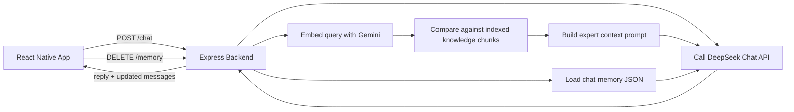

# DeepSeek Fitness Coach Chatbot (React Native + RAG)

A mobile AI fitness coaching assistant built with React Native (Expo) and a Node.js RAG backend.

This project demonstrates end-to-end product engineering for a practical AI app:
- mobile chat UX with file upload and conversation state,
- retrieval-augmented generation (RAG) over local domain knowledge,
- LLM orchestration with safety-oriented prompting,
- persistent short-term memory for multi-turn conversations.

## Why This Project

Most chatbot demos stop at a single API call. This app goes further by combining:
- **Mobile-first user experience** (React Native + Expo)
- **Domain-grounded responses** via RAG over curated fitness knowledge files
- **Personalization** from uploaded user health profile text
- **Backend memory persistence** for conversational continuity

Use case: provide concise, actionable fitness suggestions grounded in trusted context rather than generic model output.

## Tech Stack

- **Frontend:** React Native, Expo, React Native Paper, Axios
- **Backend:** Node.js, Express, CORS, dotenv
- **AI/LLM:** DeepSeek Chat Completions API
- **Embeddings:** Google Gemini Embeddings (`gemini-embedding-001`)
- **Storage:** local JSON file for chat memory, local `.txt` knowledge files for retrieval

## Key Features

- Upload a `.txt` health profile from mobile before chatting
- Chat UI with message history and loading states
- RAG pipeline over `knowledge/` text files
- Top-k semantic retrieval using cosine similarity
- Context-aware system prompting (safety + concise output format)
- Persistent memory via `memory-store/default.json`
- Backend endpoints for health checks, retrieval, chat, and memory reset

## Architecture



## Project Structure

```text
deepseek-chatbot/
  App.js
  components/
    ChatScreen.js
  rag-backend.js
  knowledge/
    *.txt
  memory-store/
    default.json
  android/
  ios/
```

## Prerequisites

- Node.js 18+
- npm 9+
- Expo CLI tooling via `npx expo ...`
- Android Studio emulator and/or Xcode (for iOS)
- API keys:
  - DeepSeek API key
  - Gemini API key

## Environment Variables

Create a `.env` file in the project root:

```env
DEEPSEEK_API_KEY=your_deepseek_key
GEMINI_API_KEY=your_gemini_key
DEEPSEEK_API_URL=https://api.deepseek.com/v1/chat/completions
PORT=3001
```

Notes:
- `DEEPSEEK_API_URL` is optional (default is already set in code).
- Backend fails chat operations if required keys are missing.

## Installation

```bash
npm install
```

## Run Locally

Use two terminals.

### 1) Start RAG backend

```bash
npm run rag:backend
```

Expected backend URL: `http://localhost:3001`

### 2) Start mobile app

```bash
npm run start
```

Then launch on platform:

```bash
npm run android
# or
npm run ios
```

## Mobile ↔ Backend Networking

`components/ChatScreen.js` uses platform-specific backend URLs:
- Android emulator: `http://10.0.2.2:3001`
- iOS simulator / web: `http://localhost:3001`

If testing on a physical device, update the backend URL to your machine LAN IP.

## How RAG Works in This Project

1. On backend startup, all `.txt` files in `knowledge/` are read.
2. Files are chunked into paragraph groups.
3. Chunks are embedded with Gemini.
4. For each user query, backend embeds the query.
5. Top-k similar chunks are selected via cosine similarity.
6. Retrieved context + uploaded profile + conversation memory are sent to DeepSeek.

This helps keep responses grounded in provided domain material and user-specific context.

## API Endpoints

- `GET /health` - backend status and index metadata
- `GET /knowledge/status` - indexed knowledge files/chunks
- `POST /knowledge/reload` - re-index knowledge directory
- `POST /retrieve` - raw retrieval debugging endpoint
- `POST /chat` - main chat endpoint
- `GET /memory` - fetch stored conversation messages
- `DELETE /memory` - clear stored memory

## Example Demo Flow

1. Start backend and app.
2. Upload a `.txt` user profile from the app.
3. Ask a fitness question (e.g., recovery, training load, injury risk).
4. Receive a concise response grounded in uploaded data + curated knowledge files.

## Security and Production Notes

- This repository is configured for local development.
- Never commit real API keys.
- Add rate limiting, auth, and request validation before production use.
- Consider replacing local file memory with a database for multi-user scenarios.

## Future Improvements

- Streaming tokens for better chat UX
- Unit/integration tests for retrieval and chat routes
- Better chunking strategies and metadata filtering
- User profile schema validation and richer ingestion formats (CSV/PDF)
- Deployment setup (containerized backend + managed secrets)

## What This Demonstrates to Employers

- Full-stack mobile + backend implementation
- Practical RAG design with retrieval and prompt composition
- API integration and environment-driven configuration
- Product-oriented thinking: UX flow, safety constraints, and personalization

## License

Currently set to `0BSD` in `package.json`.

---

If you are reviewing this for hiring purposes, I am happy to walk through architecture decisions, trade-offs, and planned production hardening.
